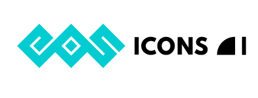

# GSoC-2021-Project-Report

Final report for Google Summer of Code - 2021 at Python Software Foundation (EOS)

## EOS-Icons plugins for Figma and Adobe XD

## Project Summary

EOS delivers a set of icons that are made 1-to-1 following Material Design Icons. The icons were previously available for downloads through the CDN, the npm repo or directly through the eos-icons website. The goal of the project was to bring the EOS Icons collection natively into the widely used designing tools like Figma and Adobe XD, to ensure easier and faster access to the icons for designers. The plugins ensure the designer doesn't have to leave the tool to fetch icons, reducing the hashle and allowing wider adoption from the community.

## Development

After the initial prototyping phase to make a minimal plugin for both Adobe and Figma, we decided to move to the EOS Icons React package to not reinvent the wheel. This has brought various benefits and would allow the user to work on the projects without being connected to the network. We have added scripts to allow for preprocessing the icons whenever a new version comes out. The tests have been added to ensure nothing breaks in between cycles.

## Contributions

- Add custom webpack configuration to allow React to be used for the plugins.
- Add preprocessor script to prepare the json files dynamically before release for the icons and the categories. This would ensure no human interaction is required, other than running them. Reducing the possibilities of bugs between versions.
- Revamped UI allowing search through the icons and showing the initial options available.
- More visual feedback to the user compared to v1 UI.
- Add tests to ensure better testing when merging PRs.
- Integrated codecov to visualize the tests.
- Configured ESLint and Prettier for better code quality.
- Migrated the Figma plugin to use Typescript.
- Exploring the documentation to understand the APIs and the limitations(hardest part :)).

## My Code Contributions

Adobe plugin contributions can be found [here](https://github.com/EOS-uiux-Solutions/eos-icons-adobe-xd/pulls?q=is%3Apr+author%3AAbhirup-99+)

Figma plugin contributions can be found [here](https://github.com/EOS-uiux-Solutions/eos-icons-figma/pulls?q=is%3Apr+author%3AAbhirup-99+)

## My Journey

I have written technical blogs for each week, documenting my journey through the entire GSOC period. You can find them [here](https://blogs.python-gsoc.org/en/abhirup99s-blog/)

## New Ideas

I have some interesting ideas for the future.

- Adding testing while mocking the inbuilt Adobe XD APIs.
- Improving the UI. This is a never ending process :).
- Exploring the pros and cons of getting the icons from the server side, reducing the bundle size.

## Thank you

I want to thank all my mentors for guiding me through the various edge cases and helping me test the plugins on multiple devices. Since it's a closed source product, few examples were available and documentation was the only source. I want to thank my fellow GSOC students for helping me abstract out the details through the EOS Icons react library reducing the work required to accomplish the plugins.

Thank you and peace out :) (Insert Tony Stark meme)
